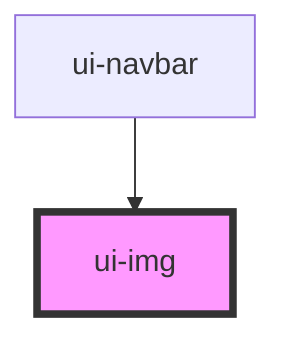

# ui-img

<!-- Auto Generated Below -->

## Properties

| Property | Attribute | Description | Type                      | Default       |
| -------- | --------- | ----------- | ------------------------- | ------------- |
| `alt`    | `alt`     |             | `string`                  | `""`          |
| `height` | `height`  |             | `string`                  | `"100%"`      |
| `src`    | `src`     |             | `string`                  | `""`          |
| `type`   | `type`    |             | `"circle" \| "rectangle"` | `"rectangle"` |
| `width`  | `width`   |             | `string`                  | `"100%"`      |

## Dependencies

### Used by

 - [ui-navbar](../../molecules/ui-navbar)

### Graph

----------------------------------------------

*Built with [StencilJS](https://stenciljs.com/)*
