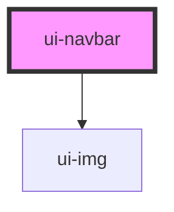

# ui-navbar

<!-- Auto Generated Below -->

## Properties

| Property | Attribute | Description | Type                                                             | Default   |
| -------- | --------- | ----------- | ---------------------------------------------------------------- | --------- |
| `fixed`  | `fixed`   |             | `boolean`                                                        | `false`   |
| `mode`   | `mode`    |             | `"dark" \| "dark-transparent" \| "light" \| "light-transparent"` | `"light"` |
| `shadow` | `shadow`  |             | `boolean`                                                        | `false`   |

## Events

| Event       | Description | Type               |
| ----------- | ----------- | ------------------ |
| `ctrlBrand` |             | `CustomEvent<any>` |

## Dependencies

### Depends on

- [ui-img](../../atoms/ui-img)

### Graph

----------------------------------------------

*Built with [StencilJS](https://stenciljs.com/)*
